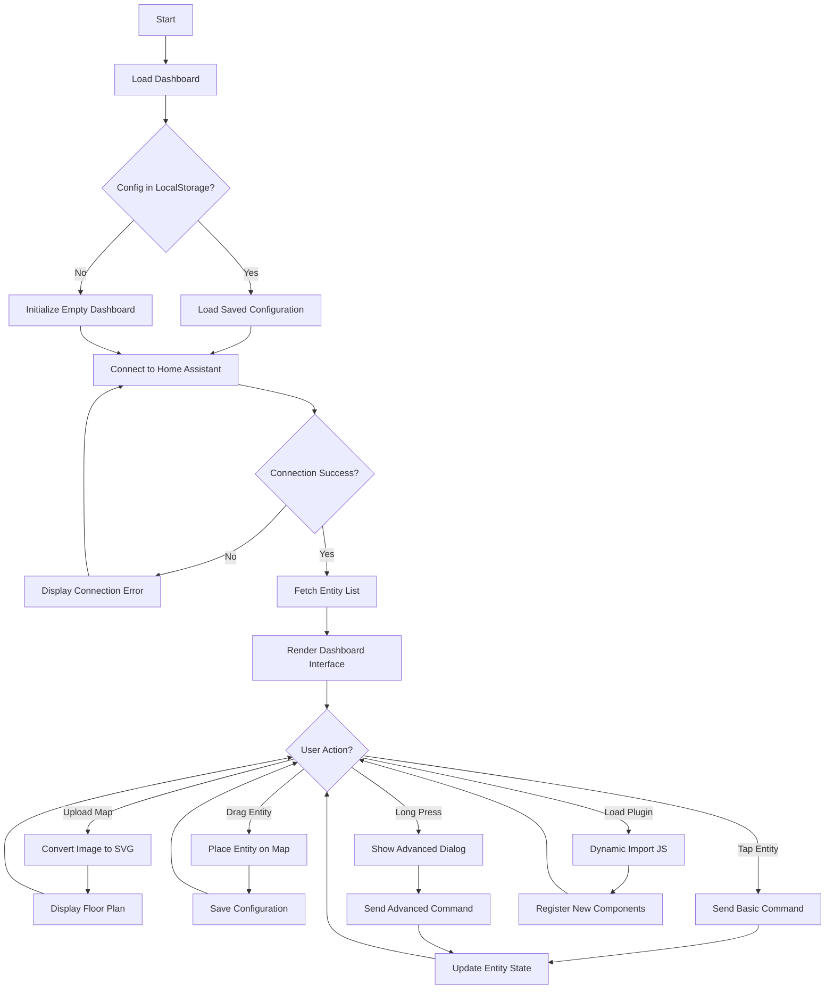
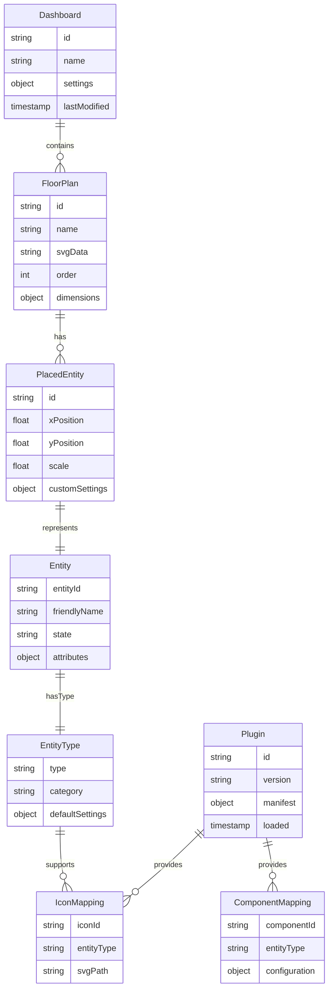
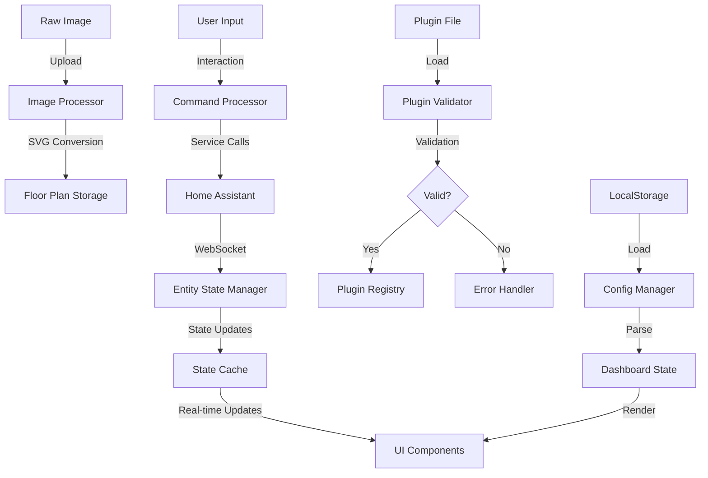
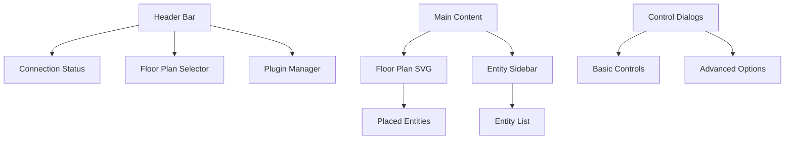

# Product Requirements Document (PRD)

# 1. INTRODUCTION

## 1.1 PURPOSE
This Product Requirements Document (PRD) specifies the requirements for a browser-based smart home control dashboard application. The document is intended for:
- Development team members implementing the system
- Project stakeholders reviewing technical specifications
- QA engineers developing test plans
- Future maintainers of the system

## 1.2 SCOPE
The smart home dashboard application will provide users with an intuitive, visual interface to control their connected home devices through the following core functionalities:

- Interactive map-based control interface using custom floor plan images
- Real-time device control through Home Assistant integration
- Drag-and-drop placement of device controls on floor plans
- Responsive design supporting both desktop and mobile interfaces
- Support for multiple device types (lights, speakers, etc.)
- Basic and advanced control options through tap and long-press interactions
- Extensible plugin architecture for additional components and icons
- Persistent storage of dashboard configurations

The system will not include:
- Home Assistant server setup and configuration
- Direct device communication protocols
- Floor plan image creation tools
- User authentication (handled by Home Assistant)

# 2. PRODUCT DESCRIPTION

## 2.1 PRODUCT PERSPECTIVE
The smart home dashboard application operates as a web-based frontend interface that integrates with an existing Home Assistant installation. The system architecture consists of:

- Frontend application built with Vite, React, and TypeScript using SWC compiler
- WebSocket communication layer using home-assistant-js-websocket library
- SVG-based rendering engine for floor plan visualization
- Browser's LocalStorage for configuration persistence
- Home Assistant backend providing device control and state management

The application functions as an independent visualization and control layer while relying on Home Assistant for core smart home functionality.

## 2.2 PRODUCT FUNCTIONS
The primary functions include:

- Floor plan management
  - Image upload and SVG conversion
  - Dynamic scaling and responsive display
  - Multi-floor support

- Device control interface
  - Drag-and-drop device placement
  - Basic control through tap interactions
  - Advanced control through long-press dialogs
  - Real-time state updates

- Entity management
  - Automatic entity discovery from Home Assistant
  - Icon-entity type matching
  - Custom entity configuration

- Plugin system
  - Dynamic component loading
  - Custom icon pack support
  - Extensible functionality modules

## 2.3 USER CHARACTERISTICS
Target users include:

1. Smart Home Enthusiasts
   - Comfortable with technology
   - Experience with Home Assistant
   - Desire for customization
   
2. Household Members
   - Various technical expertise levels
   - Need simple device control interface
   - Mobile and desktop usage

3. System Administrators
   - Technical background
   - Plugin development capabilities
   - Configuration management experience

## 2.4 CONSTRAINTS
1. Technical Constraints
   - Must run in modern web browsers
   - Requires active Home Assistant installation
   - Limited to browser's LocalStorage capacity
   - WebSocket connection dependency

2. Interface Constraints
   - Touch-friendly controls for mobile
   - Minimum screen size requirements
   - SVG rendering capabilities

3. Integration Constraints
   - Home Assistant API compatibility
   - Plugin system security limitations
   - Real-time update performance

## 2.5 ASSUMPTIONS AND DEPENDENCIES
Assumptions:
- Users have basic smart home knowledge
- Floor plan images are available
- Stable internet connection present
- Modern browser support for required features

Dependencies:
- Home Assistant server
- home-assistant-js-websocket library
- React and TypeScript ecosystem
- SVG rendering capabilities
- Browser LocalStorage API
- WebSocket protocol support

# 3. PROCESS FLOWCHART

# 4. FUNCTIONAL REQUIREMENTS

## 4.1 HOME ASSISTANT INTEGRATION
### ID: F-001
### Description
Connection and communication with Home Assistant server for entity management and control
### Priority
HIGH
### Requirements

| ID | Requirement | Acceptance Criteria |
|----|-------------|-------------------|
| F-001.1 | WebSocket Connection | Must establish and maintain WebSocket connection using home-assistant-js-websocket library |
| F-001.2 | Entity Discovery | Must retrieve and parse complete list of available entities from Home Assistant |
| F-001.3 | State Management | Must maintain real-time entity state synchronization |
| F-001.4 | Service Calls | Must execute appropriate service calls for entity control |
| F-001.5 | Error Handling | Must implement reconnection logic and user notifications for connection issues |

## 4.2 FLOOR PLAN MANAGEMENT
### ID: F-002
### Description
Upload and management of floor plan images with SVG conversion
### Priority
HIGH
### Requirements

| ID | Requirement | Acceptance Criteria |
|----|-------------|-------------------|
| F-002.1 | Image Upload | Must accept common image formats (PNG, JPG, JPEG) |
| F-002.2 | SVG Conversion | Must convert uploaded images to SVG format for rendering |
| F-002.3 | Responsive Display | Must scale SVG to fit different screen sizes while maintaining aspect ratio |
| F-002.4 | Multi-Floor Support | Must support multiple floor plans with navigation between them |
| F-002.5 | Image Optimization | Must optimize SVG output for performance |

## 4.3 ENTITY PLACEMENT
### ID: F-003
### Description
Drag and drop functionality for entity placement on floor plans
### Priority
HIGH
### Requirements

| ID | Requirement | Acceptance Criteria |
|----|-------------|-------------------|
| F-003.1 | Drag and Drop | Must support smooth drag and drop of entity icons onto floor plan |
| F-003.2 | Position Storage | Must store and retrieve exact coordinates of placed entities |
| F-003.3 | Icon Matching | Must automatically assign appropriate icons based on entity type |
| F-003.4 | Entity Removal | Must allow removal of placed entities from floor plan |
| F-003.5 | Position Adjustment | Must allow repositioning of placed entities |

## 4.4 ENTITY CONTROL
### ID: F-004
### Description
Interactive control of placed entities through tap and long-press actions
### Priority
HIGH
### Requirements

| ID | Requirement | Acceptance Criteria |
|----|-------------|-------------------|
| F-004.1 | Tap Control | Must execute basic toggle actions on tap (on/off, play/pause) |
| F-004.2 | Long-Press Dialog | Must display advanced control dialog on long-press |
| F-004.3 | State Display | Must visually indicate current entity state |
| F-004.4 | Advanced Controls | Must provide entity-specific advanced controls (brightness, color, volume) |
| F-004.5 | Response Time | Must respond to user input within 100ms |

## 4.5 PLUGIN SYSTEM
### ID: F-005
### Description
Dynamic loading and integration of plugin components
### Priority
MEDIUM
### Requirements

| ID | Requirement | Acceptance Criteria |
|----|-------------|-------------------|
| F-005.1 | Plugin Loading | Must dynamically load JavaScript plugins at runtime |
| F-005.2 | Component Registration | Must register new components from plugins into main application |
| F-005.3 | Icon Pack Support | Must support custom icon packs through plugins |
| F-005.4 | Security | Must validate plugins before loading |
| F-005.5 | Version Management | Must handle plugin versioning and compatibility |

## 4.6 CONFIGURATION PERSISTENCE
### ID: F-006
### Description
Storage and retrieval of dashboard configuration
### Priority
HIGH
### Requirements

| ID | Requirement | Acceptance Criteria |
|----|-------------|-------------------|
| F-006.1 | Local Storage | Must save complete configuration to browser's LocalStorage |
| F-006.2 | Auto-Save | Must automatically save changes to configuration |
| F-006.3 | Configuration Format | Must store configuration in valid JSON format |
| F-006.4 | Data Validation | Must validate configuration data on load |
| F-006.5 | Storage Limits | Must handle LocalStorage size limitations gracefully |

# 5. NON-FUNCTIONAL REQUIREMENTS

## 5.1 PERFORMANCE
| Requirement | Description | Target Metric |
|------------|-------------|---------------|
| Response Time | Maximum time for UI interactions to reflect changes | < 100ms |
| WebSocket Latency | Round-trip time for Home Assistant commands | < 200ms |
| Initial Load Time | Time to load and render dashboard | < 3s |
| SVG Rendering | Time to render floor plan after upload | < 1s |
| Memory Usage | Browser memory consumption | < 200MB |
| LocalStorage Operations | Time to save/load configuration | < 500ms |

## 5.2 SAFETY
| Requirement | Description | Implementation |
|------------|-------------|----------------|
| Data Backup | Prevent configuration loss | Auto-save every 5 minutes |
| Error Recovery | Graceful handling of failures | Automatic reconnection to Home Assistant |
| State Consistency | Prevent invalid device states | State validation before commands |
| Offline Detection | Alert users to connection loss | Real-time connection status indicator |
| Safe Defaults | Fallback values for missing data | Default configuration templates |

## 5.3 SECURITY
| Requirement | Description | Implementation |
|------------|-------------|----------------|
| Authentication | User verification | Leverage Home Assistant authentication |
| Data Protection | Secure storage of configuration | Encrypted LocalStorage data |
| Plugin Security | Safe plugin execution | Sandboxed plugin environment |
| API Security | Secure communication | WSS protocol for WebSocket |
| Cross-Site Scripting | Prevent XSS attacks | React's built-in XSS protection |

## 5.4 QUALITY
### 5.4.1 Availability
- System uptime: 99.9% excluding Home Assistant downtime
- Maximum planned downtime: 1 hour/month
- Recovery time objective: < 5 minutes

### 5.4.2 Maintainability
- Modular architecture with clear separation of concerns
- Comprehensive TypeScript type definitions
- Component reusability score > 80%
- Documentation coverage > 90%

### 5.4.3 Usability
- Mobile-first responsive design
- Maximum 3 clicks/taps to perform any action
- Intuitive drag-and-drop interface
- Clear visual feedback for all actions
- Support for screen readers

### 5.4.4 Scalability
- Support for up to 500 entities
- Floor plans up to 10MB in size
- Maximum 20 concurrent plugin loads
- Support for up to 10 floor plans
- Handle up to 100 simultaneous state changes

### 5.4.5 Reliability
- Error rate < 0.1%
- WebSocket connection stability > 99.9%
- Plugin execution success rate > 99%
- Configuration save success rate 100%
- Zero data loss during normal operation

## 5.5 COMPLIANCE
| Requirement | Description | Standard/Regulation |
|------------|-------------|-------------------|
| Web Standards | Browser compatibility | WCAG 2.1 Level AA |
| Accessibility | Interface accessibility | Section 508 |
| Data Privacy | User data handling | GDPR, CCPA |
| Security Standards | Security implementation | OWASP Top 10 |
| Code Quality | Development standards | ESLint, Prettier configs |

# 6. DATA REQUIREMENTS

## 6.1 DATA MODELS

## 6.2 DATA STORAGE

### 6.2.1 Local Storage Schema

| Storage Key | Data Type | Description | Size Limit |
|-------------|-----------|-------------|------------|
| dashboard_config | JSON | Complete dashboard configuration | 5MB |
| floor_plans | JSON Array | SVG and metadata for floor plans | 10MB |
| entity_placements | JSON Array | Entity position data | 1MB |
| plugin_registry | JSON | Installed plugin information | 1MB |
| cached_entities | JSON | Entity state cache | 2MB |

### 6.2.2 Data Retention
- Dashboard configuration: Persistent until manual deletion
- Floor plan SVGs: Cached indefinitely
- Entity states: Cached for current session only
- Plugin data: Retained until plugin uninstallation
- Error logs: 7 days rolling retention

### 6.2.3 Backup Strategy
- Automatic configuration export feature
- JSON backup file generation
- Version history (last 3 configurations)
- Import/Export functionality for sharing
- Automatic backup before plugin installation

## 6.3 DATA PROCESSING

### 6.3.1 Data Security

| Data Type | Security Measure | Implementation |
|-----------|-----------------|----------------|
| Entity Credentials | Never stored locally | Handled by Home Assistant |
| Configuration Data | Base64 encoded | LocalStorage encryption |
| Plugin Code | Hash verification | SHA-256 validation |
| WebSocket Traffic | SSL/TLS | WSS protocol |
| Cached States | Session-only storage | Cleared on logout |

### 6.3.2 Data Validation

| Data Type | Validation Rules | Error Handling |
|-----------|-----------------|----------------|
| Floor Plan SVG | Size < 10MB, valid SVG | Reject oversized/invalid files |
| Entity Positions | Within bounds, valid coordinates | Snap to valid position |
| Plugin Data | Valid manifest, approved APIs | Reject non-compliant plugins |
| Configuration JSON | Schema validation | Restore from backup |
| Entity States | Type checking, range validation | Use default values |

# 7. EXTERNAL INTERFACES

## 7.1 USER INTERFACES

### 7.1.1 General Layout

### 7.1.2 Interface Components

| Component | Description | Interaction Method |
|-----------|-------------|-------------------|
| Floor Plan View | SVG-based map display | Pan, zoom, tap |
| Entity Sidebar | Draggable entity list | Drag, scroll |
| Entity Icons | Interactive device controls | Tap, long-press |
| Control Dialog | Modal interface for advanced options | Touch, click |
| Floor Selector | Dropdown/tab navigation | Tap, click |
| Plugin Manager | Plugin installation interface | Click |

### 7.1.3 Responsive Breakpoints

| Breakpoint | Screen Width | Layout Adjustments |
|------------|-------------|-------------------|
| Mobile | < 768px | Collapsed sidebar, full-width map |
| Tablet | 768px - 1024px | Side-by-side with flexible widths |
| Desktop | > 1024px | Fixed sidebar, expanded map |

## 7.2 SOFTWARE INTERFACES

### 7.2.1 Home Assistant Integration

| Interface | Specification | Purpose |
|-----------|--------------|----------|
| WebSocket API | home-assistant-js-websocket | Real-time communication |
| Authentication | Long-lived access tokens | Secure connection |
| State Updates | Event subscription | Real-time entity updates |
| Service Calls | REST API | Device control commands |

### 7.2.2 Browser APIs

| API | Usage | Requirements |
|-----|-------|-------------|
| LocalStorage | Configuration persistence | 5MB minimum storage |
| File API | Floor plan upload | Image file handling |
| SVG | Floor plan rendering | SVG 1.1 support |
| WebSocket | Real-time communication | WSS protocol support |
| DOM Events | Drag and drop functionality | Touch/mouse events |

### 7.2.3 Plugin Interface

| Interface | Type | Description |
|-----------|------|-------------|
| Component Registry | JavaScript API | Dynamic component registration |
| Icon Provider | JavaScript API | Custom icon pack integration |
| Event Bus | Pub/Sub | Plugin communication |
| Configuration API | JSON | Plugin settings management |

## 7.3 COMMUNICATION INTERFACES

### 7.3.1 WebSocket Protocol

| Aspect | Specification | Details |
|--------|--------------|---------|
| Protocol | WSS | Secure WebSocket protocol |
| Message Format | JSON | State and command data |
| Reconnection | Exponential backoff | 1s, 2s, 4s, 8s, max 30s |
| Heartbeat | 30s interval | Connection health check |

### 7.3.2 Data Exchange Formats

| Format | Usage | Schema |
|--------|-------|--------|
| Entity State | JSON | `{entity_id, state, attributes}` |
| Commands | JSON | `{domain, service, data}` |
| Configuration | JSON | `{floorplans, entities, settings}` |
| Plugin Manifest | JSON | `{id, version, components}` |

### 7.3.3 API Endpoints

| Endpoint | Method | Purpose |
|----------|--------|---------|
| /api/websocket | WSS | Real-time communication |
| /api/states | GET | Entity state retrieval |
| /api/services | POST | Service calls |
| /api/config | GET | Home Assistant config |

# 8. APPENDICES

## 8.1 GLOSSARY

| Term | Definition |
|------|------------|
| Entity | A device or service controlled through Home Assistant |
| Floor Plan | An SVG representation of a building layout used for entity placement |
| Plugin | A JavaScript module that extends dashboard functionality |
| Service Call | A command sent to Home Assistant to control an entity |
| WebSocket | A protocol providing full-duplex communication between client and server |
| Long-Press | A touch or click interaction held for an extended duration |
| Icon Pack | A collection of SVG icons representing different entity types |

## 8.2 ACRONYMS

| Acronym | Definition |
|---------|------------|
| API | Application Programming Interface |
| DOM | Document Object Model |
| GDPR | General Data Protection Regulation |
| JSON | JavaScript Object Notation |
| PRD | Product Requirements Document |
| REST | Representational State Transfer |
| SVG | Scalable Vector Graphics |
| SWC | Speedy Web Compiler |
| UI | User Interface |
| WSS | WebSocket Secure |
| XSS | Cross-Site Scripting |
| CCPA | California Consumer Privacy Act |
| WCAG | Web Content Accessibility Guidelines |
| OWASP | Open Web Application Security Project |

## 8.3 ADDITIONAL REFERENCES

| Reference | Description | URL |
|-----------|-------------|-----|
| Home Assistant WebSocket API | Official API documentation | https://developers.home-assistant.io/docs/api/websocket |
| Vite Documentation | Build tool documentation | https://vitejs.dev/guide/ |
| React Documentation | UI library documentation | https://reactjs.org/docs |
| TypeScript Handbook | Language documentation | https://www.typescriptlang.org/docs/ |
| SWC Documentation | Compiler documentation | https://swc.rs/docs |
| SVG Specification | W3C SVG standard | https://www.w3.org/TR/SVG2/ |
| LocalStorage API | MDN Web Storage documentation | https://developer.mozilla.org/docs/Web/API/Window/localStorage |
| WebSocket Protocol | RFC 6455 specification | https://datatracker.ietf.org/doc/html/rfc6455 |

## 8.4 DEVELOPMENT TOOLS

| Tool | Purpose | Version |
|------|---------|---------|
| Vite | Build system | ^4.0.0 |
| React | UI framework | ^18.0.0 |
| TypeScript | Programming language | ^5.0.0 |
| SWC | JavaScript/TypeScript compiler | ^1.3.0 |
| ESLint | Code linting | ^8.0.0 |
| Prettier | Code formatting | ^2.0.0 |
| home-assistant-js-websocket | HA communication library | ^8.0.0 |

## 8.5 BROWSER COMPATIBILITY

| Browser | Minimum Version | Notes |
|---------|----------------|-------|
| Chrome | 90+ | Full support |
| Firefox | 88+ | Full support |
| Safari | 14+ | Full support |
| Edge | 90+ | Full support |
| iOS Safari | 14+ | Touch optimization required |
| Chrome Android | 90+ | Touch optimization required |