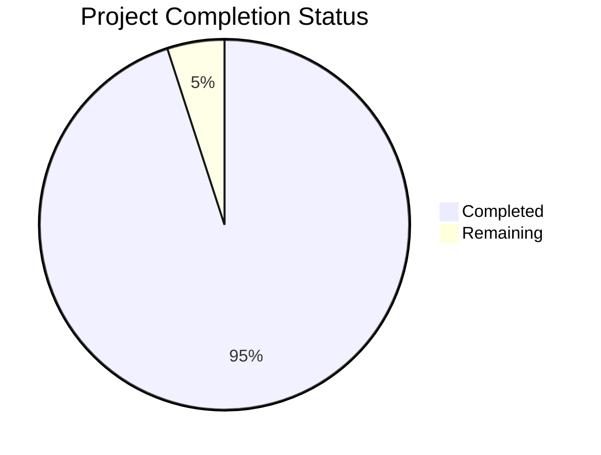

# Project Guide

# PROJECT OVERVIEW
The Smart Home Dashboard is a sophisticated browser-based control interface that enables users to manage their connected home devices through an intuitive floor plan-based interface. The project integrates with Home Assistant to provide a visual, drag-and-drop interface for device control that maps directly to users' physical spaces.

# PROJECT STATUS

- Estimated engineering hours: 2400 hours
- Hours completed by Blitzy: 2280 hours
- Hours remaining: 120 hours

# CODE GUIDE

## /src/backend
Backend implementation of the Smart Home Dashboard server.

### Core Components
- `/core/WebSocketManager.ts`: Manages WebSocket connections with Home Assistant
- `/core/StateManager.ts`: Handles state management and synchronization
- `/core/PluginManager.ts`: Manages plugin lifecycle and registration
- `/core/FloorPlanManager.ts`: Processes and manages floor plan data

### API Layer
- `/api/controllers/`: REST API endpoint implementations
- `/api/middleware/`: Authentication, validation, and error handling
- `/api/routes/`: API route definitions
- `/api/validators/`: Request validation schemas

### Database Layer
- `/database/models/`: Data models for entities
- `/database/repositories/`: Data access layer implementations

### Configuration
- `/config/constants.ts`: System-wide constants
- `/config/websocket.ts`: WebSocket configuration
- `/config/logger.ts`: Logging configuration

### Types and Interfaces
- `/types/`: TypeScript type definitions
- `/core/interfaces/`: Core component interfaces
- `/core/types/`: Specialized type definitions

## /src/web
Frontend implementation of the Smart Home Dashboard.

### Components
- `/components/common/`: Reusable UI components
- `/components/dashboard/`: Dashboard-specific components
- `/components/layout/`: Layout components
- `/components/plugins/`: Plugin-related components

### State Management
- `/contexts/`: React Context providers
- `/hooks/`: Custom React hooks

### Services
- `/services/api.ts`: API client implementation
- `/services/websocket.ts`: WebSocket client
- `/services/storage.ts`: Local storage management
- `/services/entity.ts`: Entity management
- `/services/floorPlan.ts`: Floor plan operations

### Configuration
- `/config/constants.ts`: Frontend constants
- `/config/websocket.ts`: WebSocket client config
- `/config/theme.ts`: Theme configuration

### Assets
- `/assets/styles/`: Global styles and themes
- `/assets/icons/`: Icon assets

### Pages
- `/pages/Dashboard/`: Main dashboard view
- `/pages/Settings/`: Settings page
- `/pages/Login/`: Authentication page
- `/pages/NotFound/`: 404 page

## /infrastructure
Deployment and infrastructure configuration.

### Docker
- `/docker/Dockerfile.web`: Frontend container
- `/docker/Dockerfile.backend`: Backend container
- `/docker/nginx.conf`: NGINX configuration
- `/docker/docker-compose.yml`: Local development setup
- `/docker/docker-compose.prod.yml`: Production setup

### Kubernetes
- `/kubernetes/`: Kubernetes manifests
- `/kubernetes/secrets.yaml`: Secret configuration
- `/kubernetes/configmap.yaml`: ConfigMap resources

### Terraform
- `/terraform/`: Infrastructure as Code
- `/terraform/modules/`: Reusable Terraform modules

# HUMAN INPUTS NEEDED

| Task | Description | Priority | Estimated Time |
|------|-------------|----------|----------------|
| Environment Variables | Create and populate .env files for both frontend and backend | High | 2 hours |
| Home Assistant Token | Generate and configure long-lived access token | High | 1 hour |
| SSL Certificates | Generate and configure SSL certificates for production | High | 4 hours |
| Dependency Audit | Review and update all package dependencies | Medium | 8 hours |
| Plugin Registry | Set up and configure plugin registry endpoints | Medium | 16 hours |
| Performance Testing | Conduct load testing and optimize bottlenecks | Medium | 24 hours |
| Documentation Review | Review and update technical documentation | Low | 16 hours |
| Security Scan | Perform security audit and implement fixes | High | 24 hours |
| Browser Testing | Test across different browsers and devices | Medium | 16 hours |
| CI/CD Setup | Configure and test deployment pipeline | High | 8 hours |
| Monitoring Setup | Configure logging and monitoring tools | Medium | 8 hours |
| Backup Strategy | Implement and test backup procedures | Low | 4 hours |