# Technical Specifications

# 1. INTRODUCTION

## 1.1 EXECUTIVE SUMMARY

The Smart Home Dashboard project delivers a browser-based control interface that enables users to visually manage their connected home devices through an intuitive floor plan-based interface. By addressing the complexity of smart home control systems, this solution provides a user-friendly, drag-and-drop interface that maps directly to users' physical spaces. The system integrates with Home Assistant to leverage existing smart home infrastructure while providing an enhanced visualization and control layer.

Primary stakeholders include smart home enthusiasts, household members with varying technical expertise, and system administrators. The solution delivers value through simplified device management, improved spatial context for controls, and reduced friction in daily smart home interactions.

## 1.2 SYSTEM OVERVIEW

### Project Context

| Aspect | Description |
|--------|-------------|
| Business Context | Growing smart home market with need for intuitive control interfaces |
| Current Limitations | Existing interfaces lack spatial context and visual device mapping |
| Integration Landscape | Builds upon Home Assistant ecosystem, leveraging established device support |

### High-Level Description

| Component | Implementation |
|-----------|----------------|
| Frontend Framework | Vite-React-TS with SWC compiler |
| Communication Layer | home-assistant-js-websocket |
| Visualization Engine | SVG-based floor plan rendering |
| Storage Solution | Browser LocalStorage for configuration |
| Extension System | Dynamic plugin architecture |

### Success Criteria

| Metric | Target |
|--------|--------|
| Interface Response Time | < 100ms for user interactions |
| Device State Sync | Real-time updates with < 200ms latency |
| Configuration Persistence | 100% reliability in state restoration |
| Plugin Integration | Support for unlimited third-party extensions |

## 1.3 SCOPE

### In-Scope Elements

#### Core Features

| Feature | Description |
|---------|-------------|
| Floor Plan Management | Upload, display, and manage building layouts |
| Entity Placement | Drag-and-drop device positioning on floor plans |
| Device Control | Tap and long-press interaction patterns |
| State Management | Real-time synchronization with Home Assistant |
| Plugin System | Dynamic loading of components and icon packs |
| Configuration Storage | Local persistence of dashboard settings |

#### Implementation Boundaries

| Boundary | Coverage |
|----------|----------|
| User Groups | Smart home users, household members, administrators |
| Platform Support | Modern web browsers (desktop and mobile) |
| Device Support | All Home Assistant compatible entities |
| Data Scope | Device states, locations, and control configurations |

### Out-of-Scope Elements

- Home Assistant server setup and maintenance
- Direct device protocol implementations
- Floor plan creation tools
- User authentication (delegated to Home Assistant)
- Custom device firmware development
- Network infrastructure management
- Offline operation mode
- Multi-user collaboration features
- Historical data analytics
- Custom automation creation

# 2. SYSTEM ARCHITECTURE

## 2.1 HIGH-LEVEL ARCHITECTURE

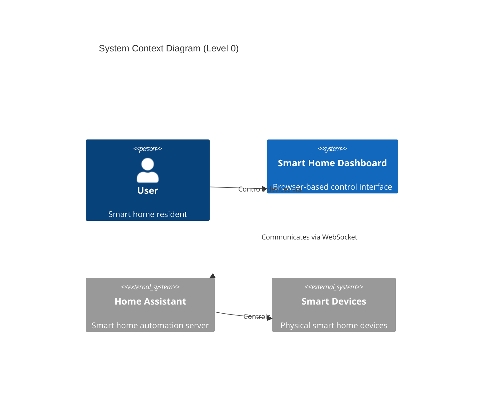
```mermaid
C4Context
    title System Context Diagram (Level 0)
    
    Person(user, "User", "Smart home resident")
    System(dashboard, "Smart Home Dashboard", "Browser-based control interface")
    System_Ext(homeAssistant, "Home Assistant", "Smart home automation server")
    System_Ext(devices, "Smart Devices", "Physical smart home devices")
    
    Rel(user, dashboard, "Controls devices via")
    Rel(dashboard, homeAssistant, "Communicates via WebSocket")
    Rel(homeAssistant, devices, "Controls")
    UpdateRelStyle(dashboard, homeAssistant, "WSS", "#green")
```

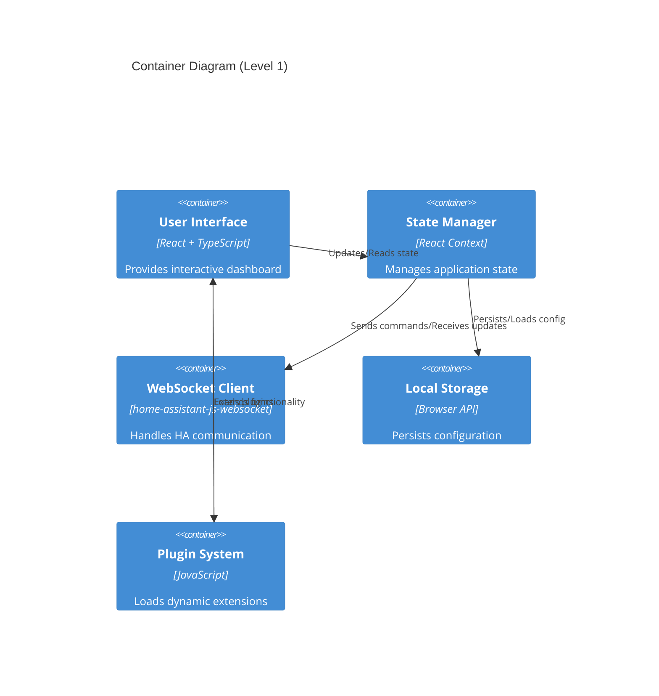
```mermaid
C4Container
    title Container Diagram (Level 1)
    
    Container(ui, "User Interface", "React + TypeScript", "Provides interactive dashboard")
    Container(stateManager, "State Manager", "React Context", "Manages application state")
    Container(wsClient, "WebSocket Client", "home-assistant-js-websocket", "Handles HA communication")
    Container(storage, "Local Storage", "Browser API", "Persists configuration")
    Container(pluginSystem, "Plugin System", "JavaScript", "Loads dynamic extensions")
    
    Rel(ui, stateManager, "Updates/Reads state")
    Rel(stateManager, wsClient, "Sends commands/Receives updates")
    Rel(stateManager, storage, "Persists/Loads config")
    Rel(ui, pluginSystem, "Loads plugins")
    Rel(pluginSystem, ui, "Extends functionality")
```

## 2.2 COMPONENT DETAILS

### 2.2.1 Core Components

| Component | Purpose | Technology | Interfaces | Data Storage | Scaling |
|-----------|---------|------------|------------|--------------|---------|
| UI Layer | User interaction | React + TypeScript | DOM Events | None | Component-based |
| State Manager | Application state | React Context | Context API | Memory | Context splitting |
| WebSocket Client | HA communication | home-assistant-js-websocket | WebSocket API | None | Connection pooling |
| Storage Manager | Configuration persistence | Browser API | LocalStorage API | LocalStorage | Chunked storage |
| Plugin System | Extensibility | Dynamic imports | JavaScript API | None | Lazy loading |

### 2.2.2 Component Architecture

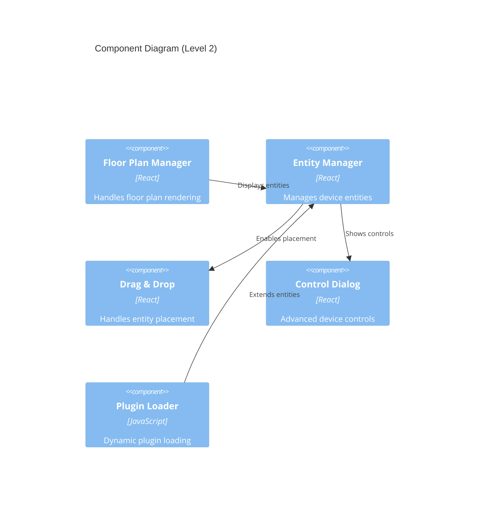
```mermaid
C4Component
    title Component Diagram (Level 2)
    
    Component(floorPlan, "Floor Plan Manager", "React", "Handles floor plan rendering")
    Component(entityManager, "Entity Manager", "React", "Manages device entities")
    Component(dragDrop, "Drag & Drop", "React", "Handles entity placement")
    Component(controlDialog, "Control Dialog", "React", "Advanced device controls")
    Component(pluginLoader, "Plugin Loader", "JavaScript", "Dynamic plugin loading")
    
    Rel(floorPlan, entityManager, "Displays entities")
    Rel(entityManager, dragDrop, "Enables placement")
    Rel(entityManager, controlDialog, "Shows controls")
    Rel(pluginLoader, entityManager, "Extends entities")
```

## 2.3 TECHNICAL DECISIONS

### 2.3.1 Architecture Choices

| Decision | Choice | Rationale |
|----------|--------|-----------|
| Architecture Style | Single-page Application | Best fit for interactive dashboard |
| State Management | React Context | Sufficient for scale, built-in to React |
| Communication | WebSocket | Real-time updates required |
| Storage | LocalStorage | Simple, sufficient for config data |
| UI Framework | React + TypeScript | Strong typing, component reuse |

### 2.3.2 Data Flow

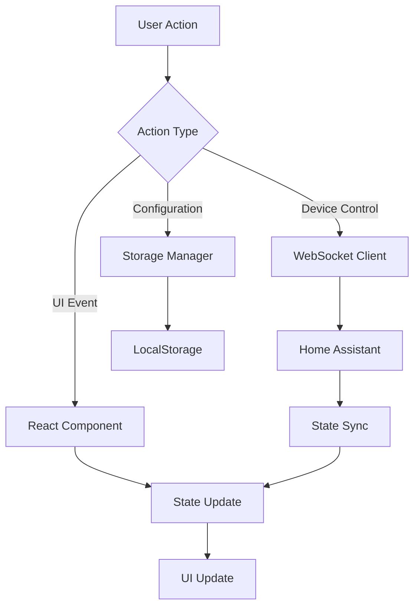
```mermaid
flowchart TD
    A[User Action] --> B{Action Type}
    B -->|UI Event| C[React Component]
    B -->|Device Control| D[WebSocket Client]
    B -->|Configuration| E[Storage Manager]
    
    C --> F[State Update]
    D --> G[Home Assistant]
    E --> H[LocalStorage]
    
    G --> I[State Sync]
    I --> F
    F --> J[UI Update]
```

## 2.4 CROSS-CUTTING CONCERNS

### 2.4.1 System Monitoring

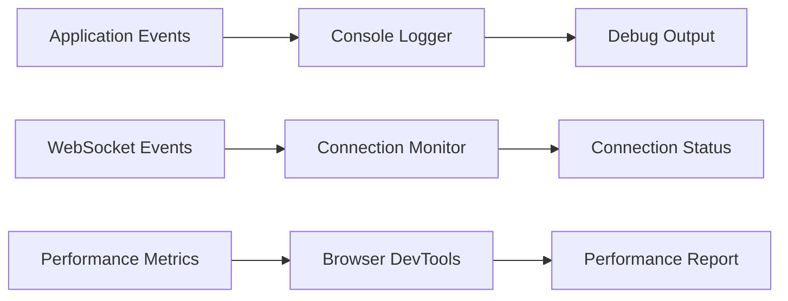
```mermaid
flowchart LR
    A[Application Events] --> B[Console Logger]
    C[WebSocket Events] --> D[Connection Monitor]
    E[Performance Metrics] --> F[Browser DevTools]
    
    B --> G[Debug Output]
    D --> H[Connection Status]
    F --> I[Performance Report]
```

### 2.4.2 Implementation Details

| Concern | Implementation | Technology |
|---------|----------------|------------|
| Logging | Browser Console | Console API |
| Error Handling | Error Boundaries | React Error Boundaries |
| Authentication | Token-based | Home Assistant Tokens |
| Performance | React Profiler | React DevTools |
| Security | Content Security Policy | Browser Security Headers |

### 2.4.3 Deployment Architecture

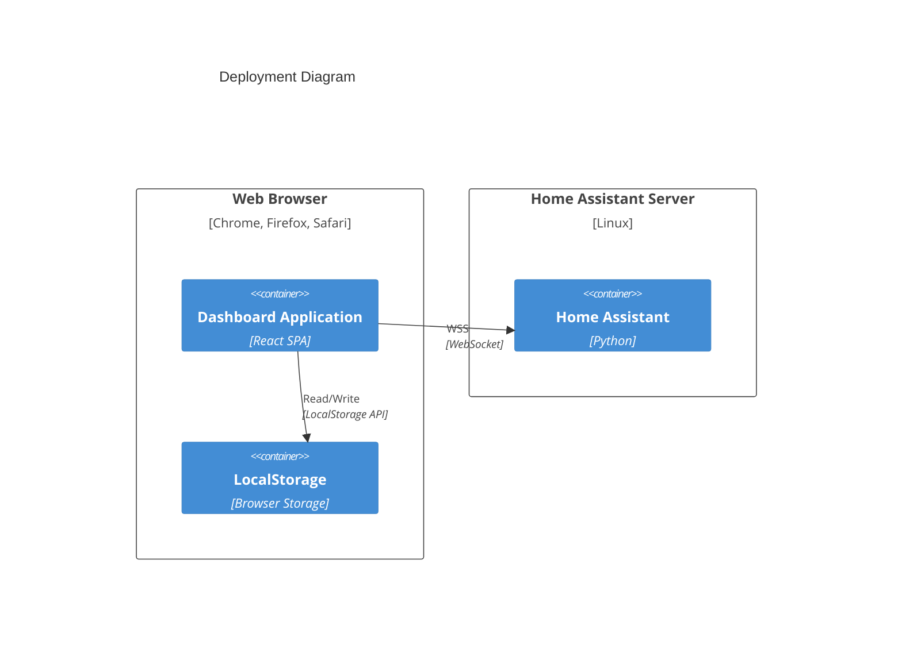
```mermaid
C4Deployment
    title Deployment Diagram
    
    Deployment_Node(browser, "Web Browser", "Chrome, Firefox, Safari") {
        Container(app, "Dashboard Application", "React SPA")
        Container(storage, "LocalStorage", "Browser Storage")
    }
    
    Deployment_Node(server, "Home Assistant Server", "Linux") {
        Container(ha, "Home Assistant", "Python")
    }
    
    Rel(app, ha, "WSS", "WebSocket")
    Rel(app, storage, "Read/Write", "LocalStorage API")
```

## 2.5 PERFORMANCE CONSIDERATIONS

| Component | Metric | Target |
|-----------|--------|--------|
| Initial Load | Time to Interactive | < 3s |
| WebSocket | Message Latency | < 100ms |
| UI Updates | Frame Rate | 60fps |
| Plugin Load | Load Time | < 500ms |
| Storage Operations | Operation Time | < 100ms |

# 3. SYSTEM COMPONENTS ARCHITECTURE

## 3.1 USER INTERFACE DESIGN

### 3.1.1 Design Specifications

| Aspect | Requirement | Implementation |
|--------|-------------|----------------|
| Visual Hierarchy | Flat design with clear entity focus | Material Design principles |
| Component Library | Reusable React components | Custom styled-components |
| Responsive Design | Mobile-first approach | Flexbox/Grid with breakpoints |
| Accessibility | WCAG 2.1 Level AA | ARIA labels, semantic HTML |
| Browser Support | Modern browsers (last 2 versions) | Progressive enhancement |
| Theme Support | Light/Dark mode | CSS variables system |
| Internationalization | LTR layout only | English-only initially |

### 3.1.2 Layout Structure

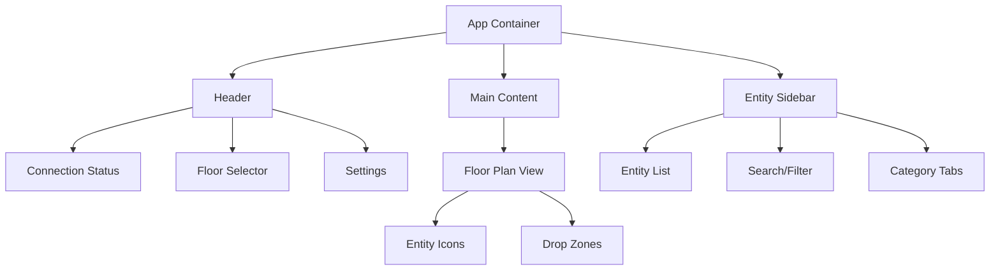
```mermaid
graph TD
    A[App Container] --> B[Header]
    A --> C[Main Content]
    A --> D[Entity Sidebar]
    
    B --> B1[Connection Status]
    B --> B2[Floor Selector]
    B --> B3[Settings]
    
    C --> C1[Floor Plan View]
    C1 --> C2[Entity Icons]
    C1 --> C3[Drop Zones]
    
    D --> D1[Entity List]
    D --> D2[Search/Filter]
    D --> D3[Category Tabs]
```

### 3.1.3 Critical User Flows

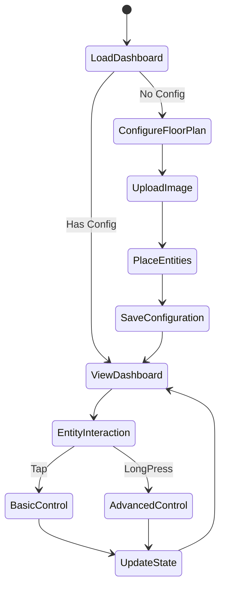
```mermaid
stateDiagram-v2
    [*] --> LoadDashboard
    LoadDashboard --> ConfigureFloorPlan: No Config
    LoadDashboard --> ViewDashboard: Has Config
    
    ConfigureFloorPlan --> UploadImage
    UploadImage --> PlaceEntities
    PlaceEntities --> SaveConfiguration
    SaveConfiguration --> ViewDashboard
    
    ViewDashboard --> EntityInteraction
    EntityInteraction --> BasicControl: Tap
    EntityInteraction --> AdvancedControl: LongPress
    
    BasicControl --> UpdateState
    AdvancedControl --> UpdateState
    UpdateState --> ViewDashboard
```

### 3.1.4 Component Specifications

| Component | States | Interactions | Feedback |
|-----------|--------|--------------|----------|
| Entity Icon | Normal, Active, Disabled | Tap, Long-press, Drag | Visual state, Haptic |
| Floor Plan | Loading, Ready, Error | Pan, Zoom, Drop | Loading spinner |
| Control Dialog | Open, Closed, Loading | Modal interaction | Overlay animation |
| Entity List | Loading, Filtered, Empty | Scroll, Drag, Search | Dynamic updates |
| Connection Status | Connected, Disconnected, Reconnecting | Click to retry | Color indicators |

## 3.2 LOCAL STORAGE DESIGN

### 3.2.1 Data Models

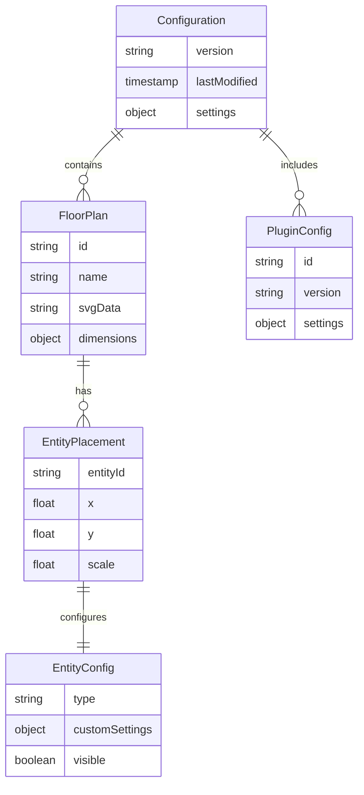
```mermaid
erDiagram
    Configuration ||--o{ FloorPlan : contains
    FloorPlan ||--o{ EntityPlacement : has
    EntityPlacement ||--|| EntityConfig : configures
    Configuration ||--o{ PluginConfig : includes
    
    Configuration {
        string version
        timestamp lastModified
        object settings
    }
    
    FloorPlan {
        string id
        string name
        string svgData
        object dimensions
    }
    
    EntityPlacement {
        string entityId
        float x
        float y
        float scale
    }
    
    EntityConfig {
        string type
        object customSettings
        boolean visible
    }
    
    PluginConfig {
        string id
        string version
        object settings
    }
```

### 3.2.2 Storage Structure

| Storage Key | Purpose | Format | Size Limit |
|-------------|---------|--------|------------|
| dashboard_config | Core settings | JSON | 100KB |
| floor_plans | SVG and metadata | JSON Array | 2MB per plan |
| entity_placements | Position data | JSON Array | 500KB |
| plugin_data | Plugin settings | JSON Object | 1MB |
| entity_states | State cache | JSON Object | 1MB |

### 3.2.3 Data Management

| Aspect | Strategy | Implementation |
|--------|----------|----------------|
| Versioning | Semantic versioning | Version field in config |
| Migrations | Forward-only | Version-specific transforms |
| Backup | Auto-export | JSON file download |
| Cleanup | Session cleanup | Clear temporary data |
| Validation | Schema validation | JSON Schema |

## 3.3 HOME ASSISTANT API INTEGRATION

### 3.3.1 WebSocket Protocol

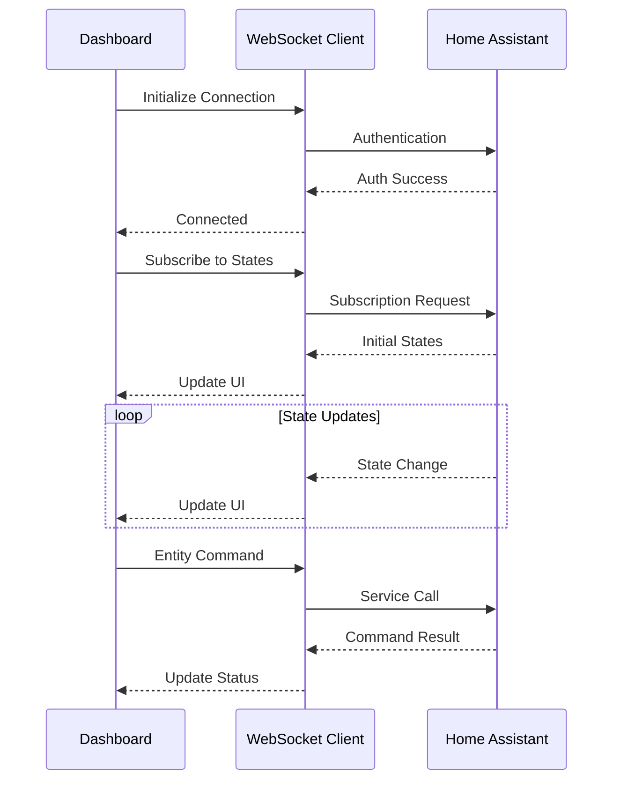
```mermaid
sequenceDiagram
    participant D as Dashboard
    participant WS as WebSocket Client
    participant HA as Home Assistant
    
    D->>WS: Initialize Connection
    WS->>HA: Authentication
    HA-->>WS: Auth Success
    WS-->>D: Connected
    
    D->>WS: Subscribe to States
    WS->>HA: Subscription Request
    HA-->>WS: Initial States
    WS-->>D: Update UI
    
    loop State Updates
        HA-->>WS: State Change
        WS-->>D: Update UI
    end
    
    D->>WS: Entity Command
    WS->>HA: Service Call
    HA-->>WS: Command Result
    WS-->>D: Update Status
```

### 3.3.2 API Specifications

| Endpoint Type | Format | Authentication |
|--------------|--------|----------------|
| WebSocket | JSON | Long-lived token |
| State Updates | Event stream | WebSocket auth |
| Service Calls | JSON-RPC | WebSocket auth |
| Media | Binary | Token header |

### 3.3.3 Integration Requirements

| Requirement | Implementation | Fallback |
|-------------|----------------|----------|
| Authentication | Token-based | Reconnect flow |
| State Sync | Real-time events | Polling |
| Command Queue | In-memory queue | Local cache |
| Error Handling | Retry with backoff | User notification |
| Rate Limiting | Client-side throttle | Command batching |

# 4. TECHNOLOGY STACK

## 4.1 PROGRAMMING LANGUAGES

| Language | Version | Usage | Justification |
|----------|---------|-------|---------------|
| TypeScript | 5.0+ | Frontend development | Static typing, enhanced IDE support, better maintainability |
| JavaScript | ES2022 | Plugin system, Runtime | Native browser support, dynamic loading capabilities |
| SVG/XML | 1.1 | Floor plan rendering | Standard vector graphics format, scalable rendering |
| CSS | 3 | Styling and animations | Modern styling capabilities, animation support |

## 4.2 FRAMEWORKS & LIBRARIES

### 4.2.1 Core Framework Stack

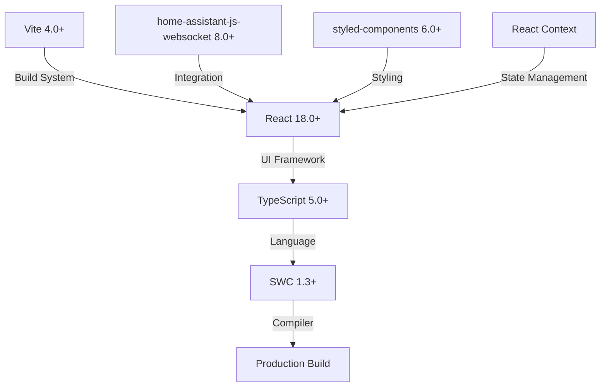
```mermaid
graph TD
    A[Vite 4.0+] -->|Build System| B[React 18.0+]
    B -->|UI Framework| C[TypeScript 5.0+]
    C -->|Language| D[SWC 1.3+]
    D -->|Compiler| E[Production Build]
    
    F[home-assistant-js-websocket 8.0+] -->|Integration| B
    G[styled-components 6.0+] -->|Styling| B
    H[React Context] -->|State Management| B
```

| Component | Version | Purpose | Justification |
|-----------|---------|---------|---------------|
| Vite | 4.0+ | Build tooling | Fast HMR, efficient bundling, modern defaults |
| React | 18.0+ | UI framework | Component reusability, virtual DOM, ecosystem |
| TypeScript | 5.0+ | Language | Type safety, developer experience |
| SWC | 1.3+ | Compiler | Performance, modern JavaScript support |
| home-assistant-js-websocket | 8.0+ | HA integration | Official library, WebSocket handling |
| styled-components | 6.0+ | CSS-in-JS | Dynamic styling, theme support |

### 4.2.2 Supporting Libraries

| Library | Version | Purpose | Dependencies |
|---------|---------|---------|--------------|
| react-dnd | 16.0+ | Drag and drop | React 16.8+ |
| react-use | 17.0+ | Utility hooks | React 16.8+ |
| zod | 3.0+ | Schema validation | TypeScript 4.5+ |
| date-fns | 2.0+ | Date handling | None |
| nanoid | 4.0+ | ID generation | None |

## 4.3 DATABASES & STORAGE

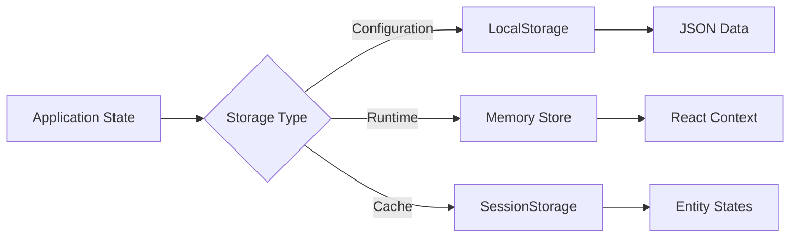
```mermaid
flowchart LR
    A[Application State] --> B{Storage Type}
    B -->|Configuration| C[LocalStorage]
    B -->|Runtime| D[Memory Store]
    B -->|Cache| E[SessionStorage]
    
    C --> F[JSON Data]
    D --> G[React Context]
    E --> H[Entity States]
```

| Storage Type | Implementation | Purpose | Limits |
|--------------|----------------|---------|--------|
| LocalStorage | Browser API | Configuration persistence | 5-10MB |
| Memory Store | React Context | Runtime state | RAM bound |
| SessionStorage | Browser API | Temporary caching | 5-10MB |

## 4.4 THIRD-PARTY SERVICES

### 4.4.1 External Integrations

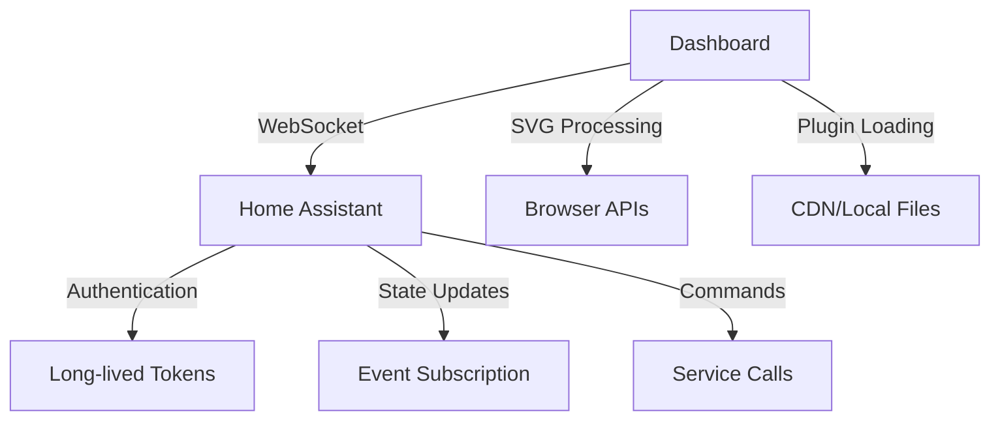
```mermaid
graph TD
    A[Dashboard] -->|WebSocket| B[Home Assistant]
    A -->|SVG Processing| C[Browser APIs]
    A -->|Plugin Loading| D[CDN/Local Files]
    
    B -->|Authentication| E[Long-lived Tokens]
    B -->|State Updates| F[Event Subscription]
    B -->|Commands| G[Service Calls]
```

| Service | Integration Type | Purpose | Authentication |
|---------|-----------------|---------|----------------|
| Home Assistant | WebSocket | Device control | Long-lived tokens |
| Browser APIs | Native | File handling, storage | N/A |
| Plugin Sources | HTTP/HTTPS | Plugin loading | None |

## 4.5 DEVELOPMENT & DEPLOYMENT

### 4.5.1 Development Tools

| Tool | Version | Purpose | Configuration |
|------|---------|---------|---------------|
| ESLint | 8.0+ | Code linting | TypeScript rules |
| Prettier | 2.0+ | Code formatting | Standard config |
| TypeScript | 5.0+ | Type checking | Strict mode |
| Vite | 4.0+ | Development server | Hot module reload |

### 4.5.2 Build Pipeline

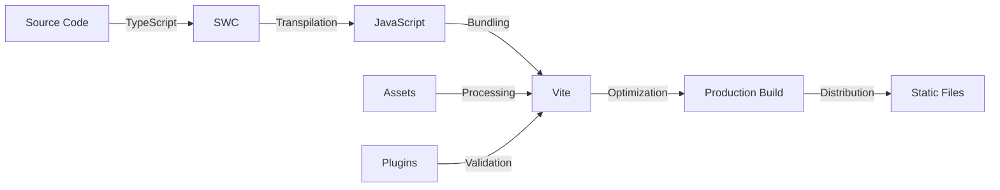
```mermaid
flowchart LR
    A[Source Code] -->|TypeScript| B[SWC]
    B -->|Transpilation| C[JavaScript]
    C -->|Bundling| D[Vite]
    D -->|Optimization| E[Production Build]
    
    F[Assets] -->|Processing| D
    G[Plugins] -->|Validation| D
    
    E -->|Distribution| H[Static Files]
```

### 4.5.3 Development Requirements

| Requirement | Specification | Tool |
|------------|---------------|------|
| Node.js | 16.0+ | Runtime |
| npm/yarn | Latest | Package management |
| Git | Latest | Version control |
| Browser | Modern evergreen | Testing |
| VS Code | Latest | IDE |

### 4.5.4 Build Output

| Asset Type | Processing | Output |
|------------|------------|--------|
| JavaScript | Bundled, minified | Single file |
| CSS | Extracted, minified | Single file |
| Assets | Optimized | Hash-named files |
| HTML | Minified | Index file |
| Source maps | Generated | Development only |

# 5. SYSTEM DESIGN

## 5.1 USER INTERFACE DESIGN

### 5.1.1 Layout Components

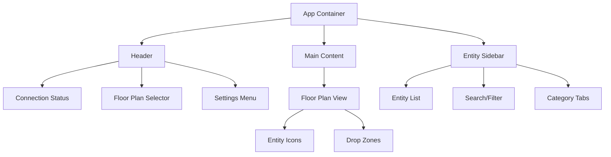
```mermaid
graph TD
    A[App Container] --> B[Header]
    A --> C[Main Content]
    A --> D[Entity Sidebar]
    
    B --> B1[Connection Status]
    B --> B2[Floor Plan Selector]
    B --> B3[Settings Menu]
    
    C --> C1[Floor Plan View]
    C1 --> C2[Entity Icons]
    C1 --> C3[Drop Zones]
    
    D --> D1[Entity List]
    D --> D2[Search/Filter]
    D --> D3[Category Tabs]
```

### 5.1.2 Component Specifications

| Component | States | Props | Events |
|-----------|--------|-------|--------|
| FloorPlanView | loading, ready, error | svgData, dimensions | onDrop, onZoom |
| EntityIcon | normal, active, disabled | entity, position | onTap, onLongPress |
| ControlDialog | open, closed, loading | entity, controls | onCommand |
| EntityList | loading, filtered, empty | entities, filter | onDragStart |
| ConnectionStatus | connected, disconnected | status, lastUpdate | onRetry |

### 5.1.3 Interaction Patterns

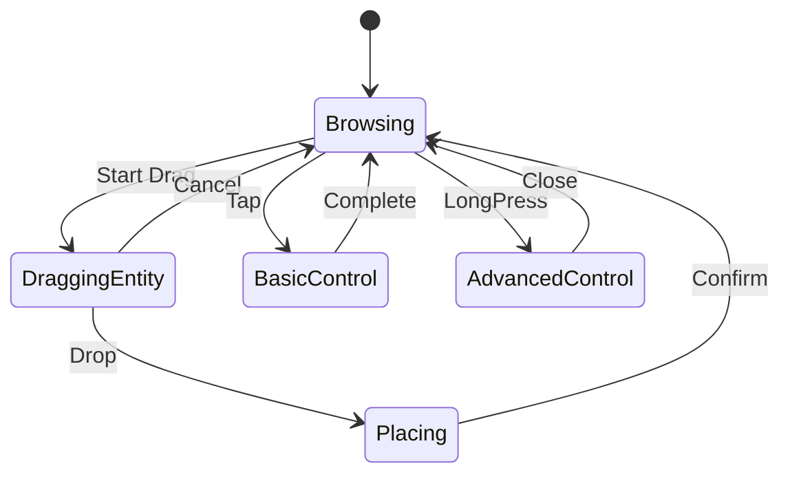
```mermaid
stateDiagram-v2
    [*] --> Browsing
    Browsing --> DraggingEntity: Start Drag
    DraggingEntity --> Browsing: Cancel
    DraggingEntity --> Placing: Drop
    Placing --> Browsing: Confirm
    
    Browsing --> BasicControl: Tap
    BasicControl --> Browsing: Complete
    
    Browsing --> AdvancedControl: LongPress
    AdvancedControl --> Browsing: Close
```

## 5.2 DATABASE DESIGN

### 5.2.1 LocalStorage Schema

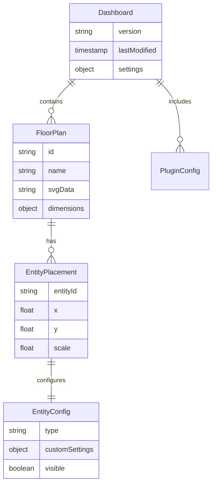
```mermaid
erDiagram
    Dashboard ||--o{ FloorPlan : contains
    FloorPlan ||--o{ EntityPlacement : has
    EntityPlacement ||--|| EntityConfig : configures
    Dashboard ||--o{ PluginConfig : includes
    
    Dashboard {
        string version
        timestamp lastModified
        object settings
    }
    
    FloorPlan {
        string id
        string name
        string svgData
        object dimensions
    }
    
    EntityPlacement {
        string entityId
        float x
        float y
        float scale
    }
    
    EntityConfig {
        string type
        object customSettings
        boolean visible
    }
```

### 5.2.2 Data Structure

| Storage Key | Purpose | Format | Size Limit |
|-------------|---------|--------|------------|
| dashboard_config | Core settings | JSON | 100KB |
| floor_plans | SVG and metadata | JSON Array | 2MB per plan |
| entity_placements | Position data | JSON Array | 500KB |
| plugin_data | Plugin settings | JSON Object | 1MB |

## 5.3 API DESIGN

### 5.3.1 WebSocket Protocol

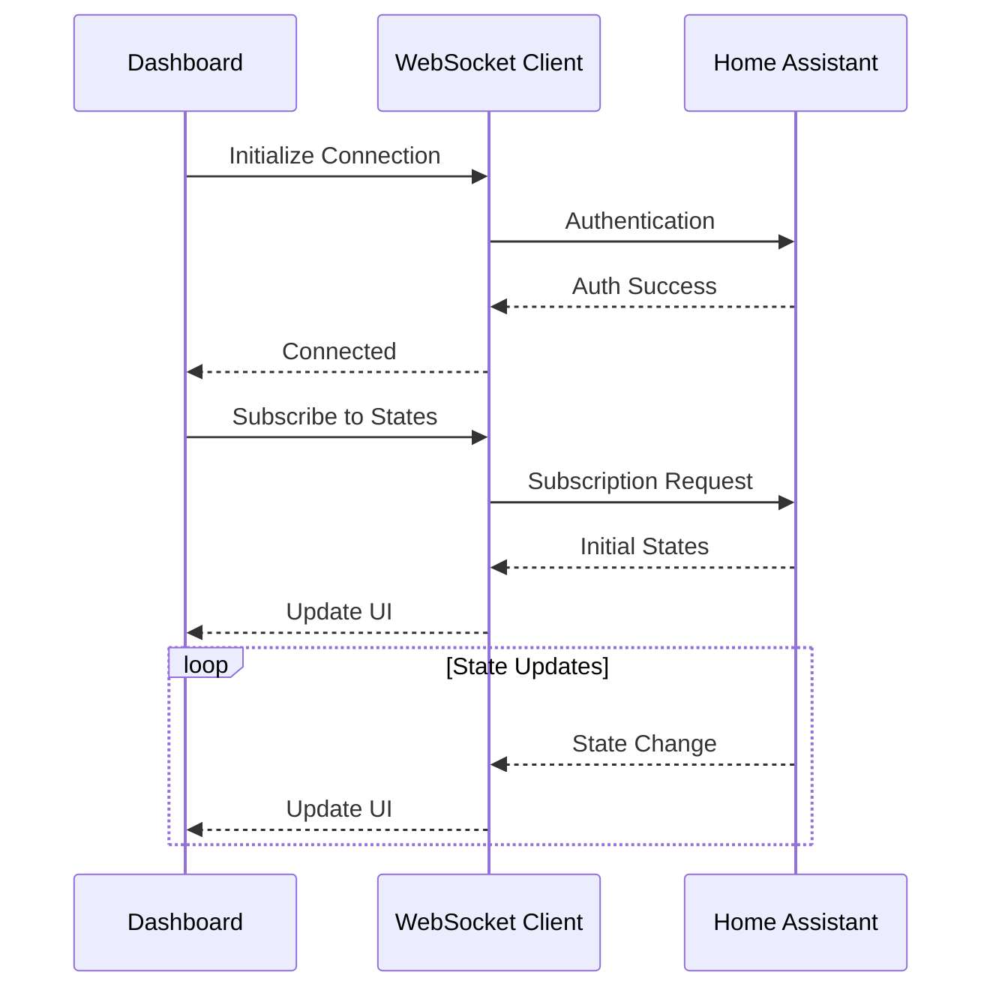
```mermaid
sequenceDiagram
    participant D as Dashboard
    participant WS as WebSocket Client
    participant HA as Home Assistant
    
    D->>WS: Initialize Connection
    WS->>HA: Authentication
    HA-->>WS: Auth Success
    WS-->>D: Connected
    
    D->>WS: Subscribe to States
    WS->>HA: Subscription Request
    HA-->>WS: Initial States
    WS-->>D: Update UI
    
    loop State Updates
        HA-->>WS: State Change
        WS-->>D: Update UI
    end
```

### 5.3.2 Plugin Interface

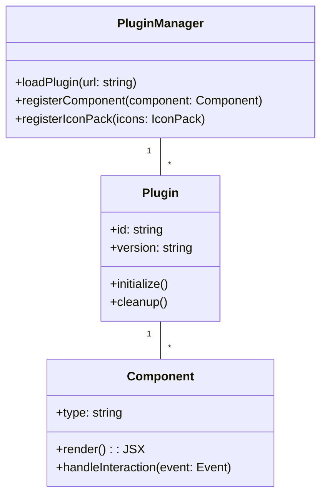
```mermaid
classDiagram
    class PluginManager {
        +loadPlugin(url: string)
        +registerComponent(component: Component)
        +registerIconPack(icons: IconPack)
    }
    
    class Plugin {
        +id: string
        +version: string
        +initialize()
        +cleanup()
    }
    
    class Component {
        +type: string
        +render(): JSX
        +handleInteraction(event: Event)
    }
    
    PluginManager "1" -- "*" Plugin
    Plugin "1" -- "*" Component
```

### 5.3.3 Internal APIs

| API | Purpose | Methods |
|-----|---------|---------|
| EntityManager | Device state handling | getState(), setState(), subscribe() |
| FloorPlanManager | SVG manipulation | loadPlan(), placEntity(), updatePosition() |
| StorageManager | Data persistence | save(), load(), clear() |
| PluginManager | Plugin lifecycle | load(), register(), unload() |

# 6. USER INTERFACE DESIGN

## 6.1 LAYOUT STRUCTURE

### 6.1.1 Main Dashboard Layout
```
+----------------------------------------------------------+
|                      Smart Home Dashboard                  |
+------------------+---------------------------------------+
| [#] Menu    [@] Profile    [!] Alerts    [=] Settings   |
+------------------+---------------------------------------+
|                  |                                       |
| +Floor Plans--+  |   +--------------------------+       |
| |[v] Ground   |  |   |                          |       |
| |[v] First    |  |   |       Floor Plan         |       |
| |[v] Basement |  |   |         View             |       |
| +------------+   |   |                          |       |
|                  |   |                          |       |
| +Entities-----+  |   |                          |       |
| |[*] Lights   |  |   |                          |       |
| |[*] Switches |  |   |                          |       |
| |[*] Climate  |  |   |                          |       |
| |[*] Media    |  |   |                          |       |
| +------------+   |   +--------------------------+       |
|                  |                                       |
+------------------+---------------------------------------+
```

### 6.1.2 Entity Control Dialog
```
+------------------------------------------+
|  Light - Living Room                   [x]|
+------------------------------------------+
|                                          |
|  Power:    (•) On  ( ) Off              |
|                                          |
|  Brightness:                             |
|  0 [====================] 100            |
|                                          |
|  Color:                                  |
|  [Color Picker Interface]                |
|                                          |
|  Presets:                               |
|  [Bright] [Reading] [Movie] [Night]     |
|                                          |
+------------------------------------------+
|          [Cancel]    [Save]              |
+------------------------------------------+
```

### 6.1.3 Floor Plan Upload
```
+------------------------------------------+
|  Upload Floor Plan                     [x]|
+------------------------------------------+
|                                          |
|  Name: [..............................]  |
|                                          |
|  Image:                                  |
|  [^] Drop image here or click to upload  |
|                                          |
|  Scale: [...] pixels = 1 meter          |
|                                          |
|  Order: [...] (display order)           |
|                                          |
+------------------------------------------+
|          [Cancel]    [Upload]            |
+------------------------------------------+
```

## 6.2 INTERACTION PATTERNS

### 6.2.1 Entity Placement
```
+------------------------------------------+
|  Drag & Drop Entity                       |
+------------------------------------------+
|                                          |
|  1. Select entity from sidebar           |
|  2. Drag to desired location             |
|  3. Release to place                     |
|                                          |
|  [?] Tip: Long press to adjust position  |
|                                          |
+------------------------------------------+
```

### 6.2.2 Quick Controls
```
+------------------+
|    Light Icon    |
+------------------+
|   [Single Tap]   |
|   Toggle On/Off  |
|                  |
|  [Long Press]    |
|  Open Controls   |
+------------------+
```

## 6.3 COMPONENT KEY

```
Symbol Key:
[?] - Help/Information
[$] - Payment related
[i] - Information
[+] - Add/Create new
[x] - Close/Delete
[<][>] - Navigation
[^] - Upload
[#] - Menu/Dashboard
[@] - User/Profile
[!] - Alerts/Warnings
[=] - Settings
[*] - Favorites/Important

Input Elements:
[ ] - Checkbox
( ) - Radio button
[Button] - Clickable button
[...] - Text input field
[====] - Progress bar
[v] - Dropdown menu

Layout Elements:
+--+ - Container border
|  | - Vertical border
+--- - Tree view/hierarchy
```

## 6.4 RESPONSIVE BREAKPOINTS

### 6.4.1 Mobile View (< 768px)
```
+------------------+
| Smart Home       |
| [#] [=] [@] [!] |
+------------------+
|   Floor Plan     |
|                  |
|                  |
+------------------+
| [Entities ^]     |
+------------------+
```

### 6.4.2 Tablet View (768px - 1024px)
```
+------------------+------------------+
| Smart Home       | [#] [=] [@] [!] |
+------------------+------------------+
|     |                              |
| E   |        Floor Plan            |
| n   |                              |
| t   |                              |
| i   |                              |
| t   |                              |
| i   |                              |
| e   |                              |
| s   |                              |
+------------------+------------------+
```

### 6.4.3 Desktop View (> 1024px)
```
+------------------+--------------------------------+
| Smart Home                     [#] [=] [@] [!]    |
+------------------+--------------------------------+
|                  |                                |
| Floor Plans      |                                |
| +-Ground         |         Floor Plan             |
| +-First          |                                |
|                  |                                |
| Entities         |                                |
| +-Lights         |                                |
| +-Climate        |                                |
| +-Media          |                                |
|                  |                                |
+------------------+--------------------------------+
```

## 6.5 THEME SUPPORT

### 6.5.1 Light Theme Colors
```
Background: #FFFFFF
Text: #000000
Primary: #007AFF
Secondary: #5856D6
Border: #C7C7CC
Success: #34C759
Warning: #FF9500
Error: #FF3B30
```

### 6.5.2 Dark Theme Colors
```
Background: #000000
Text: #FFFFFF
Primary: #0A84FF
Secondary: #5E5CE6
Border: #38383A
Success: #30D158
Warning: #FF9F0A
Error: #FF453A
```

# 7. SECURITY CONSIDERATIONS

## 7.1 AUTHENTICATION AND AUTHORIZATION

### 7.1.1 Authentication Flow

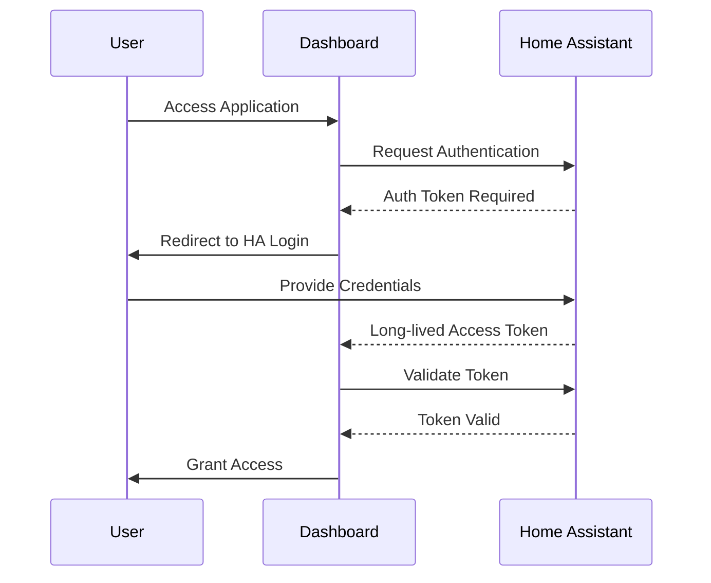
```mermaid
sequenceDiagram
    participant User
    participant Dashboard
    participant HA as Home Assistant
    
    User->>Dashboard: Access Application
    Dashboard->>HA: Request Authentication
    HA-->>Dashboard: Auth Token Required
    Dashboard->>User: Redirect to HA Login
    User->>HA: Provide Credentials
    HA-->>Dashboard: Long-lived Access Token
    Dashboard->>HA: Validate Token
    HA-->>Dashboard: Token Valid
    Dashboard->>User: Grant Access
```

### 7.1.2 Authorization Matrix

| Role | Floor Plan Management | Entity Control | Plugin Management | Configuration Access |
|------|---------------------|----------------|-------------------|---------------------|
| Admin | Full Access | Full Access | Full Access | Full Access |
| User | View Only | Basic Control | Use Only | View Only |
| Guest | View Only | View Only | None | None |

## 7.2 DATA SECURITY

### 7.2.1 Data Protection Measures

| Data Type | Storage Location | Protection Method | Access Control |
|-----------|-----------------|-------------------|----------------|
| Access Tokens | LocalStorage | AES-256 Encryption | JavaScript Memory Only |
| Floor Plans | LocalStorage | Base64 Encoding | User Session |
| Entity States | Memory Only | Runtime Encryption | Active Session |
| Plugin Code | LocalStorage | Hash Verification | Integrity Check |
| User Settings | LocalStorage | JSON Encryption | User Scope |

### 7.2.2 Data Flow Security

```mermaid
flowchart TD
    A[User Input] -->|Sanitization| B[Input Validator]
    B -->|Validation| C{Valid?}
    C -->|Yes| D[Command Processor]
    C -->|No| E[Error Handler]
    
    D -->|Encrypted| F[WebSocket]
    F -->|WSS| G[Home Assistant]
    
    H[Plugin Data] -->|Hash Check| I[Validator]
    I -->|Verification| J{Valid?}
    J -->|Yes| K[Plugin Runner]
    J -->|No| L[Security Alert]
```

## 7.3 SECURITY PROTOCOLS

### 7.3.1 Communication Security

| Protocol | Implementation | Purpose |
|----------|---------------|---------|
| WSS | WebSocket Secure | Real-time communication |
| HTTPS | TLS 1.3 | Static asset delivery |
| CSP | Content-Security-Policy | Resource access control |
| CORS | Cross-Origin Resource Sharing | API access control |

### 7.3.2 Security Headers

```typescript
const securityHeaders = {
  'Content-Security-Policy': "default-src 'self'; connect-src 'self' wss://*.home-assistant.io",
  'Strict-Transport-Security': 'max-age=31536000; includeSubDomains',
  'X-Content-Type-Options': 'nosniff',
  'X-Frame-Options': 'DENY',
  'X-XSS-Protection': '1; mode=block',
  'Referrer-Policy': 'strict-origin-when-cross-origin'
};
```

### 7.3.3 Security Monitoring

| Security Aspect | Monitoring Method | Action Threshold |
|-----------------|------------------|------------------|
| Failed Auth Attempts | Rate Limiting | 5 attempts/minute |
| Invalid Tokens | Token Validation | Immediate invalidation |
| Plugin Integrity | Hash Verification | Any mismatch |
| WebSocket Security | Connection Monitor | SSL/TLS errors |
| Data Access Patterns | Activity Logging | Suspicious patterns |

### 7.3.4 Vulnerability Prevention

```mermaid
flowchart LR
    A[Input Data] -->|Sanitization| B[XSS Prevention]
    A -->|Validation| C[Injection Prevention]
    A -->|Encoding| D[Data Escaping]
    
    E[Plugin Code] -->|Static Analysis| F[Security Scan]
    E -->|Runtime Analysis| G[Sandbox]
    
    H[API Calls] -->|Rate Limiting| I[DDoS Protection]
    H -->|Authentication| J[Access Control]
    
    K[Storage] -->|Encryption| L[Data Protection]
    K -->|Access Control| M[Scope Control]
```

### 7.3.5 Security Update Process

| Component | Update Frequency | Verification Method |
|-----------|-----------------|-------------------|
| Dependencies | Weekly | npm audit |
| Security Headers | Monthly | Security scanner |
| SSL Certificates | Auto-renewal | Certificate validation |
| Plugin Registry | On deployment | Integrity check |
| Access Tokens | 30-day rotation | Token validation |

# 8. INFRASTRUCTURE

## 8.1 DEPLOYMENT ENVIRONMENT

```mermaid
flowchart TD
    A[Smart Home Dashboard] -->|Static Assets| B[Web Server]
    B -->|Serves| C[Browser Client]
    C -->|WSS| D[Home Assistant]
    D -->|Controls| E[Smart Devices]
    
    subgraph Client Environment
        C
    end
    
    subgraph Server Environment
        B
        D
    end
    
    subgraph Smart Home Network
        E
    end
```

| Environment Type | Description | Requirements |
|-----------------|-------------|--------------|
| Development | Local environment | Node.js 16+, npm/yarn |
| Testing | Staging environment | NGINX, Home Assistant test instance |
| Production | On-premises deployment | NGINX/Apache, Home Assistant production |
| Client | End-user browsers | Modern browsers (last 2 versions) |

## 8.2 CLOUD SERVICES

| Service | Purpose | Justification |
|---------|---------|---------------|
| GitHub Pages | Static hosting (optional) | Free hosting for open-source, CDN benefits |
| Cloudflare | CDN/SSL (optional) | Enhanced security, performance optimization |
| NPM Registry | Package distribution | Standard JavaScript package distribution |

## 8.3 CONTAINERIZATION

```mermaid
graph TD
    A[Docker Container] -->|Contains| B[NGINX]
    B -->|Serves| C[Static Assets]
    B -->|Reverse Proxy| D[Home Assistant]
    
    subgraph Docker Environment
        A
        B
        C
    end
```

### 8.3.1 Docker Configuration

```yaml
# Dockerfile
FROM node:16-alpine AS builder
WORKDIR /app
COPY package*.json ./
RUN npm install
COPY . .
RUN npm run build

FROM nginx:alpine
COPY --from=builder /app/dist /usr/share/nginx/html
COPY nginx.conf /etc/nginx/conf.d/default.conf
EXPOSE 80
```

### 8.3.2 Container Specifications

| Component | Version | Purpose |
|-----------|---------|---------|
| Node.js | 16-alpine | Build environment |
| NGINX | Alpine | Web server |
| Build Stage | Multi-stage | Optimized image size |
| Runtime Stage | Alpine-based | Minimal footprint |

## 8.4 ORCHESTRATION

For single-instance deployments, container orchestration is not required. However, for scaled deployments:

| Tool | Purpose | Configuration |
|------|---------|--------------|
| Docker Compose | Local development | Multi-container setup |
| Portainer | Container management | Web-based GUI |
| Watchtower | Auto-updates | Container updates |

```yaml
# docker-compose.yml
version: '3.8'
services:
  dashboard:
    build: .
    ports:
      - "80:80"
    volumes:
      - ./nginx.conf:/etc/nginx/conf.d/default.conf
    restart: unless-stopped
```

## 8.5 CI/CD PIPELINE

```mermaid
flowchart LR
    A[Source Code] -->|Push| B[GitHub Actions]
    B -->|Build| C[Test]
    C -->|Pass| D[Lint]
    D -->|Pass| E[Build]
    E -->|Success| F[Package]
    F -->|Release| G[Deploy]
    
    subgraph CI Pipeline
        B
        C
        D
        E
    end
    
    subgraph CD Pipeline
        F
        G
    end
```

### 8.5.1 Pipeline Stages

| Stage | Actions | Tools |
|-------|---------|-------|
| Build | Install dependencies, compile | npm, SWC |
| Test | Unit tests, integration tests | Jest, Testing Library |
| Lint | Code quality checks | ESLint, Prettier |
| Package | Create production build | Vite |
| Deploy | Push to hosting | GitHub Actions |

### 8.5.2 GitHub Actions Workflow

```yaml
name: CI/CD Pipeline
on:
  push:
    branches: [ main ]
  pull_request:
    branches: [ main ]

jobs:
  build:
    runs-on: ubuntu-latest
    steps:
      - uses: actions/checkout@v3
      - uses: actions/setup-node@v3
        with:
          node-version: '16'
      - run: npm ci
      - run: npm run lint
      - run: npm test
      - run: npm run build
      - name: Deploy
        if: github.ref == 'refs/heads/main'
        uses: peaceiris/actions-gh-pages@v3
        with:
          github_token: ${{ secrets.GITHUB_TOKEN }}
          publish_dir: ./dist
```

### 8.5.3 Deployment Environments

| Environment | Trigger | Configuration |
|-------------|---------|---------------|
| Development | Push to feature branch | Automatic build |
| Staging | Pull request | Manual approval |
| Production | Push to main | Automatic deployment |

# APPENDICES

## A.1 ADDITIONAL TECHNICAL INFORMATION

### A.1.1 Plugin Development Guidelines

```mermaid
flowchart TD
    A[Plugin Entry Point] -->|Export| B[Plugin Manifest]
    B --> C{Component Type}
    C -->|Entity Component| D[Register Entity Handler]
    C -->|Icon Pack| E[Register Icons]
    C -->|Utility| F[Register Utility]
    
    D --> G[Component Registry]
    E --> H[Icon Registry]
    F --> I[Utility Registry]
    
    J[Plugin Lifecycle] --> K[Initialize]
    K --> L[Register]
    L --> M[Execute]
    M --> N[Cleanup]
```

### A.1.2 SVG Processing Pipeline

| Stage | Process | Output |
|-------|---------|--------|
| Upload | Image validation | Verified file |
| Conversion | SVG transformation | Optimized SVG |
| Optimization | Path simplification | Reduced file size |
| Validation | Structure check | Valid SVG document |
| Storage | Base64 encoding | Stored configuration |

### A.1.3 WebSocket Message Structure

| Message Type | Direction | Payload Structure |
|-------------|-----------|-------------------|
| auth_required | Server → Client | `{type: "auth_required", ha_version: string}` |
| auth | Client → Server | `{type: "auth", access_token: string}` |
| result | Server → Client | `{id: number, type: "result", success: boolean, result: any}` |
| subscribe_events | Client → Server | `{id: number, type: "subscribe_events", event_type: string}` |

## A.2 GLOSSARY

| Term | Definition |
|------|------------|
| Entity Component | A React component that represents a specific type of smart home device |
| Floor Plan | An SVG representation of a building layout used for entity placement |
| Icon Pack | A collection of SVG icons for different entity types |
| Long-press | A touch or click interaction held for extended duration (typically 500ms) |
| Plugin | A JavaScript module that extends dashboard functionality |
| Service Call | A command sent to Home Assistant to control an entity |
| State | The current condition or value of a smart home entity |
| WebSocket | A protocol for full-duplex client-server communication |

## A.3 ACRONYMS

| Acronym | Full Form |
|---------|-----------|
| API | Application Programming Interface |
| CCPA | California Consumer Privacy Act |
| CDN | Content Delivery Network |
| CSP | Content Security Policy |
| DOM | Document Object Model |
| GDPR | General Data Protection Regulation |
| HA | Home Assistant |
| HMR | Hot Module Replacement |
| JSON | JavaScript Object Notation |
| REST | Representational State Transfer |
| SPA | Single Page Application |
| SVG | Scalable Vector Graphics |
| SWC | Speedy Web Compiler |
| UI | User Interface |
| WCAG | Web Content Accessibility Guidelines |
| WSS | WebSocket Secure |
| XSS | Cross-Site Scripting |

## A.4 DEVELOPMENT ENVIRONMENT SETUP

```mermaid
flowchart LR
    A[Prerequisites] --> B[Node.js 16+]
    A --> C[npm/yarn]
    A --> D[Git]
    
    E[Project Setup] --> F[Clone Repository]
    F --> G[Install Dependencies]
    G --> H[Configure Environment]
    
    I[Development Tools] --> J[VS Code]
    I --> K[ESLint]
    I --> L[Prettier]
    
    M[Build Tools] --> N[Vite]
    M --> O[SWC]
    M --> P[TypeScript]
```

## A.5 ERROR CODES AND HANDLING

| Error Code | Description | Recovery Action |
|------------|-------------|----------------|
| AUTH_001 | Authentication Failed | Retry with valid token |
| CONN_001 | WebSocket Connection Lost | Automatic reconnection |
| STOR_001 | LocalStorage Quota Exceeded | Clear unused data |
| PLUG_001 | Plugin Load Failed | Retry or disable plugin |
| SVG_001 | Invalid Floor Plan Format | Verify file format |
| ENT_001 | Entity Not Found | Refresh entity list |
| CONF_001 | Invalid Configuration | Reset to defaults |